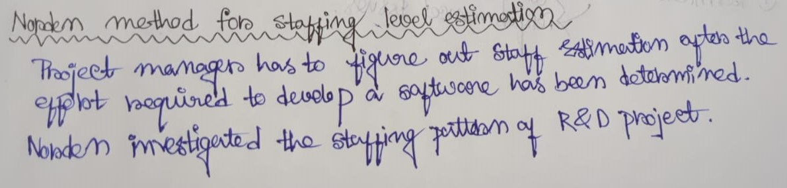
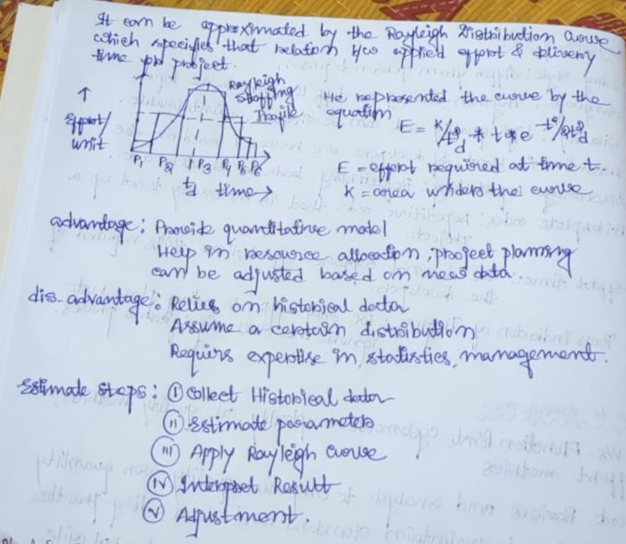

# Software Engineering

### 1. *Write down the drawbacks of LOC to measure project size. How they can overcome?*

#### Answer: 
Using Lines of Code (LOC) as a metric for measuring project size has several drawbacks. Here are the detailed reasons why LOC can be problematic:

1. #### *Lack of Uniformity*:
   - *Coding Styles*: Different programmers have different coding styles. One developer might write concise code while another might write more verbose code to achieve the same functionality. This makes LOC an inconsistent measure.
   - *Languages*: Different programming languages have different levels of expressiveness. For instance, a task that takes 10 lines of code in Python might take 30 lines in Java or C++. Therefore, LOC does not account for the language used.

2. #### *Quality vs. Quantity*:
   - *Code Quality*: LOC does not measure the quality of code. High-quality, efficient, and well-documented code can be shorter than inefficient, poorly written code.
   - *Maintainability*: More lines of code can sometimes mean more complexity and potentially lower maintainability, making the project harder to manage and debug.

3. #### *Encourages Inefficiency*:
   - *Incentive for Bloat*: If developers are measured or rewarded based on LOC, there is a risk that they might write more lines of code than necessary, leading to bloated and less efficient codebases.
   - *Discourages Refactoring*: Refactoring code to be cleaner and more efficient often reduces the number of lines. If LOC is a key metric, developers might avoid refactoring to not reduce their LOC count.

4. #### *Misleading Metric*:
   - *Simple Tasks vs. Complex Tasks*: LOC doesn’t differentiate between simple tasks that require a lot of lines and complex tasks that require fewer lines due to sophisticated logic.
   - *Boilerplate Code*: Some languages and frameworks require a lot of boilerplate code (repetitive code that is necessary to set up a project), which can artificially inflate the LOC count without adding meaningful functionality.

5. #### *Doesn’t Capture Effort or Complexity*:
   - *Complexity*: Writing a few lines of highly complex code can be more challenging and time-consuming than writing many lines of straightforward code. LOC doesn’t capture this complexity.
   - *Effort and Time*: LOC doesn’t reflect the effort, time, or skill required to develop the code. It doesn’t account for planning, design, debugging, and testing efforts.

6. #### *Poor Indicator of Progress*:
   - *Development Phases*: Different phases of development (planning, design, coding, testing, debugging) require varying amounts of time and effort. LOC mainly applies to the coding phase and ignores the significant efforts in other phases.
   - *Functional Progress*: Increasing LOC does not necessarily mean that a project is closer to completion or that more functionality has been added.

7. #### *Automation and Reusability*:
   - *Code Generation*: Modern development practices involve the use of code generation tools, libraries, and frameworks that can generate large amounts of code automatically. This inflates LOC without reflecting actual development effort.
   - *Reusable Code*: Effective use of reusable code (libraries, modules) means fewer lines of new code are written, which might inaccurately suggest less progress or effort.

8. #### *Documentation and Comments*:
   - *Non-Code Lines*: Lines of code can include comments and documentation, which are important for maintainability but don’t contribute directly to functionality. LOC counts these lines equally, which can distort the measurement.

#### To overcome the drawbacks associated with using Lines of Code (LOC) as a metric for measuring project size, several strategies and alternative approaches can be adopted:

1. #### *Use Complementary Metrics*:
   - *Function Points (FP)*: Measures the functionality delivered to the user, providing a language-independent metric that focuses on the complexity and features of the software.
   - *Cyclomatic Complexity*: Assesses the complexity of the code by counting the number of linearly independent paths through the program, which helps in understanding the code's maintainability.
   - *Code Quality Metrics*: Use tools that measure code quality aspects like code smells, duplication, test coverage, and adherence to coding standards.
   - *Effort Metrics*: Track developer hours, tasks completed, and other effort-related metrics to provide a more holistic view of the project's progress.

2. #### *Emphasize Code Quality Over Quantity*:
   - *Code Reviews*: Regular code reviews can help ensure code quality, readability, and maintainability, which are not reflected by LOC.
   - *Automated Code Analysis*: Use static analysis tools to automatically evaluate code quality and identify potential issues early.

3. #### *Encourage Efficient and Clean Coding Practices*:
   - *Refactoring*: Promote regular refactoring to improve code quality and reduce complexity, rather than focusing on the number of lines written.
   - *Coding Standards*: Implement and enforce coding standards to ensure consistency across the codebase, making it easier to manage and maintain.

4. #### *Adopt Agile and Iterative Development*:
   - *User Stories and Tasks*: Measure progress based on user stories or tasks completed, which focus on delivering value to the user rather than the amount of code written.
   - *Sprint Reviews and Demos*: Use sprint reviews and demos to assess progress and functionality delivered, providing a better gauge of project advancement.

5. #### *Focus on Deliverables and Milestones*:
   - *Milestones*: Set clear milestones and measure progress against them. Milestones can include the completion of major features, integration points, or other significant deliverables.
   - *Customer Feedback*: Regularly gather feedback from stakeholders and users to ensure that the development is on track and meeting requirements.

6. #### *Utilize Advanced Project Management Tools*:
   - *Issue Trackers*: Use issue tracking systems like JIRA, Trello, or Asana to monitor tasks, bugs, and feature requests, providing a more detailed view of project progress.
   - *Continuous Integration/Continuous Deployment (CI/CD)*: Implement CI/CD pipelines to automate testing, integration, and deployment, ensuring that each piece of code added is functional and integrates well with the existing codebase.

7. #### *Measure Development Velocity*:
   - *Velocity Tracking*: In Agile methodologies, track the team’s velocity (the amount of work completed in a sprint) to understand progress over time. This provides insights into how quickly the team is delivering value.

8. #### *Consider Technical Debt*:
   - *Technical Debt Metrics*: Track technical debt to understand how code quality and maintainability might impact future development. Addressing technical debt is crucial for long-term project health.

### 2. *Explain Norden's method for stuffing level estimation*
#### Ans:
Norden's method is a technique used in software engineering to estimate the level of "stuffing" or complexity in a software project. Stuffing refers to the amount of unnecessary or redundant code, features, or functionality present in a software system that can complicate development, maintenance, and performance. Norden's method helps in identifying and quantifying the level of stuffing in a project, allowing developers and project managers to address and mitigate these issues effectively. 




### 3. *What do you mean by software Risk? Explain different types of risk with example.*
#### Answer:
 In software engineering, a risk refers to any potential event or condition that can have a negative impact on the success of a project. Risks can arise from various sources and can affect different aspects of a project, including cost, schedule, quality, and functionality. Managing risks effectively is crucial for ensuring project success. Here are the various types of risks in software engineering:

### 1. Technical Risks:
   - *Technology Complexity*: Projects involving new or complex technologies may face challenges related to understanding, implementing, and integrating them.
   - *Performance Issues*: Concerns about system performance, scalability, and response times can pose technical risks.
   - *Compatibility*: Risks associated with compatibility issues between different software components, platforms, or environments.

### 2. Requirements Risks:
   - *Incomplete or Changing Requirements*: Unclear, ambiguous, or changing requirements can lead to scope creep, project delays, and increased costs.
   - *Unrealistic Expectations*: Risks arise when requirements are overly ambitious or not feasible within the project constraints.

### 3. Schedule Risks:
   - *Time Constraints*: Projects with tight deadlines face risks related to meeting milestones, deliverables, and overall project schedules.
   - *Resource Constraints*: Insufficient resources, such as skilled personnel or hardware/software resources, can impact project schedules.

### 4. Cost Risks:
   - *Budget Overruns*: Risks associated with exceeding the allocated budget due to unforeseen expenses, scope changes, or resource constraints.
   - *Estimation Errors*: Inaccurate cost estimates can lead to underestimation or overestimation of project costs, impacting financial viability.

### 5. Organizational Risks:
   - *Staffing Issues*: Risks related to the availability, skills, and motivation of project team members.
   - *Communication Challenges*: Ineffective communication within the team or with stakeholders can lead to misunderstandings, delays, and conflicts.

### 6. External Risks:
   - *Market Competition*: Risks associated with changes in market conditions, customer preferences, or competitor actions.
   - *Regulatory Compliance*: Risks related to legal or regulatory requirements, such as data privacy laws, security standards, and industry regulations.

### 7. Quality Risks:
   - *Defects and Bugs*: Risks related to the presence of software defects, bugs, or vulnerabilities that affect product quality and reliability.
   - *Testing Limitations*: Risks associated with inadequate testing coverage, test data, or testing environments.

### 8. Security Risks:
   - *Data Breaches*: Risks related to unauthorized access, data breaches, or security vulnerabilities that compromise the confidentiality, integrity, or availability of data.
   - *Cyber Attacks*: Risks posed by malicious activities such as hacking, phishing, or malware attacks targeting software systems.

### 9. Business Risks:
   - *Market Acceptance*: Risks associated with the market acceptance and adoption of the software product by customers or users.
   - *Return on Investment (ROI)*: Risks related to achieving the expected ROI or business benefits from the software project.

### 10. Legal and Compliance Risks:
   - *Intellectual Property Issues*: Risks related to infringement of intellectual property rights, patents, copyrights, or trademarks.
   - *Non-compliance*: Risks associated with failure to comply with legal, regulatory, or contractual obligations.

### Effective Risk Management
Managing risks in software engineering involves identifying, assessing, prioritizing, and mitigating risks throughout the project lifecycle. This includes proactive measures such as risk identification workshops, risk registers, risk analysis techniques (e.g., risk probability and impact assessment), risk response planning, and contingency planning to address potential risks and minimize their impact on project outcomes.

### 4. *What do you mean by Functional Independent Module?*
#### Answer:
In software engineering, a functional independent module (FIM) refers to a self-contained unit of software functionality that operates independently and performs a specific task or set of related tasks within a larger system. Each FIM encapsulates a coherent set of functions or operations that can be executed autonomously, without relying heavily on other modules or components.

Here are some key characteristics of functional independent modules:

1. *Modularity*: FIMs are designed to be modular, meaning they can be developed, tested, and maintained independently of other modules in the system. This modularity facilitates easier development and maintenance, as changes or updates to one module do not necessarily require modifications to other modules.

2. *Encapsulation*: FIMs encapsulate their functionality and data, providing well-defined interfaces for interaction with other modules. This encapsulation helps in isolating the implementation details of a module, promoting better code organization and reducing dependencies between modules.

3. *High Cohesion*: FIMs exhibit high cohesion, meaning that the functions and operations within a module are closely related and contribute to achieving a single, well-defined purpose or responsibility. This promotes better code readability, maintainability, and reusability.

4. *Low Coupling*: While FIMs may interact with other modules to accomplish broader system goals, they aim to minimize dependencies and maintain loose coupling with other modules. Low coupling reduces the ripple effects of changes and promotes system flexibility and scalability.

5. *Independence*: FIMs are designed to be functionally independent, meaning they can operate in isolation without relying heavily on external factors or states. This independence allows for easier testing, debugging, and deployment of individual modules.

6. *Reuse*: FIMs promote code reuse by encapsulating reusable functionality that can be leveraged across different parts of the system or in future projects. This reusability helps in reducing development time and effort while improving software quality and consistency.

7. *Scalability*: By breaking down the system into smaller, manageable units of functionality, FIMs enable better scalability as developers can focus on optimizing and scaling individual modules independently, rather than dealing with the entire system as a monolithic entity.
.

### 5. *Define cohesion and Coupling*
#### Answer:
Cohesion and coupling are two fundamental concepts in software engineering that describe the relationships between modules or components within a software system. Cohesion refers to the degree of relatedness or unity among the elements within a module, while coupling describes the degree of interdependence between modules. Let's define cohesion and coupling in more detail:

#### Cohesion:

Cohesion refers to the degree of relatedness or unity among the elements within a module or component. It measures how closely the functions or responsibilities within a module are related to each other. High cohesion means that the elements within the module are strongly related and focused on achieving a single, well-defined purpose or responsibility. On the other hand, low cohesion indicates that the elements within the module are loosely related and may have disparate or unrelated responsibilities.

#### Coupling:

Coupling refers to the degree of interdependence between modules or components within a software system. It measures how closely connected or reliant one module is on another. Low coupling means that modules are relatively independent of each other, with minimal dependencies. High coupling indicates strong interdependencies between modules, where changes in one module may have a significant impact on other modules. 

### 6.*Explain different types of Coupling with examples.*
#### Answer:
In software engineering, coupling refers to the degree of interdependence between modules or components in a software system. Coupling can be classified into different types based on the nature and strength of the relationships between modules. Here are the various types of coupling along with examples to illustrate each type:

#### 1. Content Coupling:

Content coupling occurs when one module directly accesses or modifies the internal data or implementation details of another module. This tight coupling can make the modules highly dependent on each other, making it difficult to change one module without affecting the other.

*Example*: Module A directly modifies variables or calls functions within Module B, exposing the internal implementation details of Module B to Module A.

#### 2. Common Coupling:

Common coupling happens when modules share a global data area or variable. This type of coupling can lead to dependencies between modules based on shared data, making it challenging to maintain and debug the system.

*Example*: Modules A and B both access and modify a global variable, leading to potential conflicts and unintended side effects.

#### 3. Control Coupling:

Control coupling occurs when one module controls the behavior of another by passing control information, such as flags or parameters. This type of coupling can lead to complex control flow and dependencies between modules.

*Example*: Module A passes a flag to Module B to indicate whether a certain action should be performed, controlling the behavior of Module B.

#### 4. Stamp Coupling:

Stamp coupling happens when modules share a composite data structure and only access part of it, leading to dependencies on the structure's format or layout. This type of coupling can make modules reliant on specific data structures, reducing flexibility and maintainability.

*Example*: Modules A and B both access a shared data structure but only use specific fields within it, leading to dependencies on the structure's format.

#### 5. Data Coupling:

Data coupling occurs when modules communicate by passing data through parameters or message passing. This loose coupling promotes modularity and reusability by minimizing dependencies between modules.

*Example*: Module A calls a function in Module B and passes data as parameters, allowing Module B to operate on the data without needing to know about the internal details of Module A.

#### 6. External Coupling:

External coupling happens when modules depend on external entities or interfaces, such as shared libraries or APIs. This type of coupling can introduce dependencies on external systems, making the software system more vulnerable to changes in those systems.

*Example*: Module A relies on a third-party library to perform specific tasks, such as file I/O or network communication.

#### 7. Temporal Coupling:

Temporal coupling occurs when modules are dependent on the timing or sequence of events. This type of coupling can lead to complex dependencies between modules based on the order of their execution.

*Example*: Module A must be executed before Module B to ensure that certain initialization tasks are completed before Module B operates correctly.

### 7. *Differentiate between software Verification and software Validation.*
#### Answer:
In software engineering, software verification and software validation are two essential processes that ensure the correctness, quality, and reliability of software products. While both processes are crucial for delivering high-quality software, they focus on different aspects of the software development lifecycle. Here is a comparison of software verification and software validation:

| **Aspect**         | **Verification**                                                        | **Validation**                                                         |
|--------------------|-------------------------------------------------------------------------|-----------------------------------------------------------------------|
| **Definition**     | Ensures software correctly implements specific functions               | Ensures software is traceable to customer requirements                |
| **Focus**          | Checking documents, designs, codes, and programs                       | Testing and validating the actual product                             |
| **Type of Testing**| Static testing                                                          | Dynamic testing                                                        |
| **Execution**      | Does not include the execution of the code                              | Includes the execution of the code                                     |
| **Methods Used**   | Reviews, walkthroughs, inspections, and desk-checking                  | Black Box Testing, White Box Testing, and non-functional testing       |
| **Goal**           | Ensures conformance to specifications                                   | Ensures the product meets customer requirements and expectations      |
| **Responsibility** | Quality assurance team                                                 | Testing team                                                          |
| **When Performed** | Throughout the development process                                      | Towards the end of the development process                            |

### 8. *What is the purpose of testing? Describe different types of Integration Testing.*

#### Answer:
Testing is a critical process in software development that aims to identify defects, validate requirements, ensure quality, and improve the reliability of software products. Here are the key purposes of testing:

1. *Identify defects and bugs*: Testing helps in identifying defects, bugs, and errors in the software code, design, or functionality. By detecting and fixing these issues early in the development process, the overall quality of the software is improved.
2. *Validate requirements*: Testing ensures that the software meets the specified requirements and functions as intended. It helps in verifying that the software behaves correctly under different conditions and scenarios.
3. *Ensure quality and reliability:* Testing helps in assessing the quality and reliability of the software by evaluating its performance, security, usability, and other critical attributes. It helps in delivering a high-quality product that meets user expectations.
4. *Prevent defects and errors:* Testing helps in preventing defects and errors from reaching the production environment, reducing the risk of software failures, security vulnerabilities, and performance issues.
5. *Improve user satisfaction:* Testing ensures that the software meets user needs, expectations, and preferences. By validating the software against user requirements, testing helps in improving user satisfaction and experience.
6. *Mitigate risks:* Testing helps in identifying and mitigating risks associated with software development, deployment, and operation. By testing the software thoroughly, potential risks and issues can be addressed proactively.
7. *Support decision-making*: Testing provides valuable insights and data that can inform decision-making processes related to software development, release, and maintenance. It helps stakeholders make informed choices based on the software's performance and quality.
8. *Maintain and evolve software:* Testing is essential for maintaining and evolving software over time. By conducting regression testing, performance testing, and other types of testing, software can be updated, enhanced, and adapted to changing requirements and environments.

### Types of Integration Testing:
Integration testing is a crucial phase in the software development lifecycle where individual modules or components are combined and tested as a group to ensure they work together as intended. There are several types of integration testing, each focusing on different aspects of the integration process. Here are some of the common types:

#### 1. Big Bang Integration Testing:
In Big Bang Integration Testing, all individual modules are integrated simultaneously to form a complete system. This approach is straightforward but can be challenging to isolate and debug issues.

#### 2. Top-Down Integration Testing:
Top-Down Integration Testing starts with the highest-level modules and progressively integrates lower-level modules. Stubs are used to simulate the behavior of lower-level modules until they are ready for integration. This approach allows for early testing of critical functionalities but may delay testing of lower-level modules.

#### 3. Bottom-Up Integration Testing:
Bottom-Up Integration Testing begins with the lowest-level modules, which are integrated and tested first. Drivers are used to simulate the behavior of higher-level modules until they are ready for integration. This approach allows for early testing of basic functionalities but may delay testing of higher-level modules.

#### 4. Incremental Integration Testing:
Incremental Integration Testing combines elements of both Top-Down and Bottom-Up approaches. It involves integrating and testing modules in small increments or batches, gradually building up to a complete system. This approach allows for early testing of integrated components and incremental validation of the system's functionality.

#### 5. Sandwich (Hybrid) Integration Testing:
Sandwich Integration Testing, also known as Hybrid Integration Testing, combines the Top-Down and Bottom-Up approaches. It integrates modules both horizontally (across layers) and vertically (within layers) to ensure comprehensive coverage. This approach strikes a balance between early testing and thorough validation of the system.

#### 6. Thread Integration Testing:
Thread Integration Testing focuses on testing the integration points or communication pathways between modules. It verifies the flow of data and control between modules to ensure seamless interaction. This approach is particularly useful for distributed systems or systems with complex interdependencies.

#### 7. Interface Integration Testing:
Interface Integration Testing focuses on testing the interfaces or APIs between modules. It verifies that data is exchanged correctly and that inputs and outputs are handled as expected. This approach is crucial for systems with multiple external dependencies or service-oriented architectures.

#### 8. Continuous Integration Testing:
Continuous Integration (CI) Testing involves integrating and testing modules frequently, usually after every code change or build. Automation tools are used to automate the integration and testing process, ensuring rapid feedback and early detection of issues. This approach is common in Agile and DevOps environments to maintain code quality and stability.

### 9. *Explain the following terms: Error, Failure, Test Case.*
#### Answer:
In software testing, the terms error, failure, and test case are fundamental concepts that help in understanding the testing process and its outcomes. Here are the definitions and explanations of these terms:

1. *Error*:
   An error refers to a mistake made by a developer while writing code. It could be a syntax error, logic error, or any other kind of mistake that causes the code to deviate from its intended behavior.

2. *Failure*:
   A failure occurs when the software behaves unexpectedly or incorrectly during execution. It indicates a deviation between the actual output of the software and the expected output. Failures are often the result of errors in the code.

3. *Test Case*:
   A test case is a set of conditions or variables under which a tester will determine whether a system under test satisfies requirements or works correctly. It includes a specific set of inputs, execution conditions, and expected outcomes, designed to verify the behavior of a software system under different scenarios. Test cases are used to validate the functionality, performance, and other aspects of the software.

### 10. *What are the different activities need to be carried out during the project planning phase?*
#### Answer:
During the project planning phase in software development, several activities need to be carried out to ensure that the project is well-defined, organized, and set up for success. These activities typically include:

1. *Define Project Scope and Objectives*:
   Clearly define the scope of the project, including its goals, objectives, deliverables, and constraints. Ensure alignment between project objectives and stakeholder expectations.

2. *Gather Requirements*:
   Collect and document requirements from stakeholders, users, and other relevant parties. Identify and prioritize functional and non-functional requirements to ensure that the project meets the needs of its intended users.

3. *Create Work Breakdown Structure (WBS)*:
   Break down the project scope into manageable tasks and activities using a hierarchical structure known as the Work Breakdown Structure (WBS). This helps in organizing and planning project activities effectively.

4. *Estimate Resources and Effort*:
   Estimate the resources (e.g., personnel, equipment, materials) and effort required to complete each task or activity identified in the WBS. Use historical data, expert judgment, and estimation techniques to develop realistic resource and effort estimates.

5. *Develop Project Schedule*:
   Develop a project schedule that outlines the timeline, milestones, dependencies, and critical path for completing project activities. Use tools such as Gantt charts or project management software to visualize and manage the project schedule effectively.

6. *Allocate Resources*:
   Assign resources (e.g., team members, budget, equipment) to project tasks based on their availability, skills, and expertise. Ensure that resources are allocated efficiently to support project objectives and meet project deadlines.

7. *Identify Risks*:
   Identify potential risks and uncertainties that could impact the success of the project. Assess the likelihood and impact of each risk and develop strategies to mitigate or respond to them effectively. Create a risk management plan to manage and monitor risks throughout the project lifecycle.

8. *Define Quality Standards*:
   Define quality standards and criteria for evaluating the quality of deliverables and outcomes. Establish quality assurance processes and procedures to ensure that project deliverables meet predefined quality requirements and standards.

9. *Develop Communication Plan*:
   Develop a communication plan that outlines how project information will be communicated, shared, and distributed among project stakeholders. Define communication channels, frequency, and protocols to facilitate effective communication and collaboration.

10. *Establish Change Management Process*:
    Establish a change management process to manage changes to project scope, requirements, schedule, or resources. Define procedures for identifying, evaluating, approving, and implementing changes, while minimizing disruptions to project progress.

11. *Define Roles and Responsibilities*:
    Define roles, responsibilities, and accountability for project team members, stakeholders, and other key individuals involved in the project. Clarify expectations and ensure that everyone understands their roles and contributions to the project.

12. *Review and Approval*:
    Review the project plan with key stakeholders to validate assumptions, obtain feedback, and secure approval. Ensure that the project plan is realistic, achievable, and aligned with organizational goals and priorities.

### 11.
 ```
 int find max(int i, int j, int k)
 {
    int max;
    if (i > j)
    {
        if (i > k)
            max = i;
        else
            max = k;
    }
    else
    {
        if (j > k)
            max = j;
        else
            max = k;
    }
    return max;
 }

```
### *a) Draw Control Flow Graph for the above program.*
### *b) Determine the McCabe's Cyclomatic complexity of the program.*
### *c) Design test suite using the following White Box Testing strategies:*
   - *Statement Coverage*
   - *Path Coverage*


#### Answer:
### a) Control Flow Graph (CFG)

The Control Flow Graph (CFG) for the given program can be drawn as follows:

1. Start
2. Evaluate `i > j`
   - True: 3
   - False: 5
3. Evaluate `i > k`
   - True: 4
   - False: 6
4. `max = i`
5. Evaluate `j > k`
   - True: 7
   - False: 8
6. `max = k`
7. `max = j`
8. `max = k`
9. Return `max`
10. End

Graphically, it looks like this:

```
      [Start]
         |
         v
     [i > j]
      /    \
    T/      \F
   /          \
[v3]          [v5]
 / \           / \
T/   \F      T/   \F
/     \     /     \
[v4] [v6] [v7]   [v8]
 \    /      \   /
  \  /        \ /
  [v9]        [v9]
     \         /
      \       /
       [End]
```

### b) McCabe's Cyclomatic Complexity

The Cyclomatic Complexity (CC) is calculated using the formula:

$ \text{CC} = E - N + 2P $

Where:
- $ E $ is the number of edges in the graph.
- $ N $ is the number of nodes in the graph.
- $ P $ is the number of connected components (usually 1 for a single program).

For the given CFG:

- Number of edges (E) = 10
- Number of nodes (N) = 9
- Number of connected components (P) = 1

$ \text{CC} = 10 - 9 + 2 = 3 $

So, the Cyclomatic Complexity of the program is 3.

### c) Test Suite Design

#### Statement Coverage

To achieve 100% statement coverage, we need to ensure that each statement in the code is executed at least once. The following test cases will cover all statements:

1. \(i = 3, j = 2, k = 1\)
   - Path: 1 → 2 (T) → 3 (T) → 4 → 9 → 10

2. \(i = 2, j = 3, k = 1\)
   - Path: 1 → 2 (F) → 5 (T) → 7 → 9 → 10

3. \(i = 1, j = 2, k = 3\)
   - Path: 1 → 2 (F) → 5 (F) → 8 → 9 → 10

#### Path Coverage

To achieve 100% path coverage, we need to ensure that every possible path through the program is executed. Given the CFG, we have the following independent paths:

1. $i > j$ and $i > k$ $i = 3, j = 2, k = 1$
   - Path: 1 → 2 (T) → 3 (T) → 4 → 9 → 10

2. $i > j$ and $i \le k$ $i = 2, j = 1, k = 3$
   - Path: 1 → 2 (T) → 3 (F) → 6 → 9 → 10

3. $i \le j$ and $j > k$ $i = 1, j = 3, k = 2$
   - Path: 1 → 2 (F) → 5 (T) → 7 → 9 → 10

4. $i \le j$ and $j \le k$ $i = 1, j = 2, k = 3$
   - Path: 1 → 2 (F) → 5 (F) → 8 → 9 → 10

The test suite with these values will ensure that all paths are covered.

**Test Suite:**
1. $i = 3, j = 2, k = 1$
2. $i = 2, j = 1, k = 3$
3. $i = 1, j = 3, k = 2$
4. $i = 1, j = 2, k = 3$

This covers all possible paths and ensures both statement and path coverage.


### 11. Draw the characteristics curves of Effort and Development Time with respect to project size for different categories of software product.
#### Answer:
The characteristics curves of effort and development time with respect to project size for different categories of software products can vary based on the complexity, scale, and nature of the software being developed. Here are the general trends observed in the effort and development time curves for different categories of software products:
Creating the characteristics curves of effort and development time with respect to project size for different categories of software products typically involves understanding the relationships and trends based on empirical data or models such as the Constructive Cost Model (COCOMO). Here’s a general outline and explanation of these curves:

### Categories of Software Products
1. *Organic*: Small, simple software projects developed in a familiar and stable environment.
2. *Semi-Detached*: Medium-sized projects with a mix of experienced and inexperienced team members.
3. *Embedded*: Large, complex software projects with stringent constraints and real-time processing requirements.

### Effort vs. Project Size
Effort is typically measured in person-months, and project size is measured in thousands of lines of code (KLOC) or function points (FP).

#### Organic Projects
- *Effort Curve*: This curve is relatively linear, reflecting that small projects require proportionally less effort.
- *Equation*: $ E = a \cdot (KLOC)^b$
- *Typical Values*: $ a \approx 2.4, b \approx 1.05 $

#### Semi-Detached Projects
- *Effort Curve*: This curve is moderately exponential, showing an increasing rate of effort with project size.
- *Equation*: $ E = a \cdot (KLOC)^b $
- *Typical Values*: $ a \approx 3.0, b \approx 1.12 $

#### Embedded Projects
- *Effort Curve*: This curve is steeply exponential, reflecting the high complexity and constraints.
- *Equation*: $ E = a \cdot (KLOC)^b $
- *Typical Values*: $ a \approx 3.6, b \approx 1.20 $

### Development Time vs. Project Size
Development time is typically measured in months.

#### Organic Projects
- *Development Time Curve*: This curve is relatively shallow, reflecting quicker completion times for smaller projects.
- *Equation*: $T=c\cdot(E)^d$
- *Typical Values*: $c \approx 2.5, d \approx 0.38 $


#### Semi-Detached Projects
- *Development Time Curve*: This curve is moderately steep, showing increasing time with project size.
- *Equation*: $ T = c \cdot (E)^d $
- *Typical Values*: $ c \approx 2.5, d \approx 0.35 $

#### Embedded Projects
- *Development Time Curve*: This curve is steeper, reflecting longer development times due to complexity.
- *Equation*: $ T = c \cdot (E)^d$
- *Typical Values*: $ c \approx 2.5, d \approx 0.32$

### Visualization
Since I can't draw directly here, I'll describe the general shape of these curves:

1. *Effort vs. Project Size*:
   - For organic projects, the curve starts at the origin and rises almost linearly.
   - For semi-detached projects, the curve starts at the origin and rises more steeply.
   - For embedded projects, the curve starts at the origin and rises very steeply, reflecting a much higher increase in effort with size.

2. *Development Time vs. Project Size*:
   - For organic projects, the curve starts at the origin and rises gently.
   - For semi-detached projects, the curve rises more steeply than for organic projects.
   - For embedded projects, the curve rises very steeply, indicating longer times required for large, complex projects.


### 12. Define software Quality and Reliability. 
#### Answer:
Software quality and reliability are two essential attributes of software products that determine their effectiveness, usability, and trustworthiness. Here are the definitions and key aspects of software quality and reliability:
### Software Quality:

Software quality refers to the degree to which a software product meets specified requirements, satisfies customer needs, and conforms to established standards and best practices. It encompasses various attributes such as functionality, usability, reliability, performance, security, maintainability, and scalability. Software quality is achieved through systematic processes, rigorous testing, adherence to coding standards, and continuous improvement efforts throughout the software development lifecycle.

### Software Reliability:

Software reliability is a measure of the probability that a software system will perform its intended functions satisfactorily within a specified environment and timeframe. It reflects the ability of a software system to consistently deliver accurate and dependable results under normal operating conditions. Reliable software minimizes the occurrence of failures, errors, and downtime, ensuring that users can rely on it to perform critical tasks effectively. Achieving software reliability involves identifying and mitigating risks, designing robust architectures, implementing defensive programming techniques, and conducting thorough testing and validation activities.

### 13.Explain the following terms: ROCOF, MTTF, MTTR, POFOD
#### Answer:
In the field of reliability engineering, several key metrics and terms are used to assess the reliability, availability, and maintainability of systems and components. Here are the definitions and explanations of the following terms:
Certainly! Let's break down each term:

#### ROCOF (Rate of Occurrence of Failures):

ROCOF, also known as Failure Rate, refers to the frequency at which failures occur in a system over a specific period. It measures the rate at which components, systems, or software experience failures, expressed typically as the number of failures per unit of time (e.g., failures per hour). ROCOF is an important metric in reliability engineering and is used to assess the reliability and performance of systems. A lower ROCOF indicates a higher level of reliability, while a higher ROCOF suggests a higher frequency of failures.

#### MTTF (Mean Time To Failure):

MTTF represents the average time elapsed between the initial operation of a system or component and the occurrence of its first failure. It is a reliability metric used to estimate the expected lifespan or operational time of a system before experiencing a failure. MTTF is calculated by dividing the total operating time of the system by the number of failures that occur within that time period. A higher MTTF value indicates greater reliability, as it implies that the system is expected to operate for a longer duration before encountering a failure.

#### MTTR (Mean Time To Repair or Recovery):

MTTR refers to the average time required to repair or restore a failed system, component, or service to its operational state after a failure occurs. It measures the efficiency and effectiveness of the repair process in resolving failures and minimizing system downtime. MTTR includes the time spent detecting, diagnosing, repairing, and verifying the resolution of failures. A lower MTTR value indicates faster recovery and shorter downtime, leading to higher system availability and reliability.

#### POFOD (Probability Of Failure On Demand):

POFOD represents the likelihood that a system or component will fail to perform its intended function when required or demanded by the user or application. It measures the probability that a failure will occur during the execution of a specific task or operation. POFOD is a critical reliability metric for safety-critical systems, where failures can have severe consequences, such as in aerospace, healthcare, and automotive industries. A lower POFOD value indicates higher reliability and confidence in the system's ability to deliver its intended functionality when needed.

### 14. *Assume that you want to develop a software product of Real Time System. And that its size is 50,000 lines of code. Assume that the Average salary of software developers is Rs 30,000 per month. Determine the effort required to develop the software product, the nominal development time, and cost to develop the product.*
#### Answer:
To estimate the effort, nominal development time, and cost to develop a real-time software system with 50,000 lines of code (KLOC = 50), we can use the Constructive Cost Model (COCOMO). Specifically, we'll use the COCOMO II model's equations for embedded projects (which is a common category for real-time systems).

### COCOMO Model Equations

For an embedded project, the basic COCOMO model provides the following equations:

1. *Effort (E) in Person-Months (PM):*
   $
   E = a \times (KLOC)^b
   $

2. *Development Time (T) in Months:*
   $
   T = c \times (E)^d
   $

Where the coefficients $a$, $b$, $c$, and $d$ are derived from historical project data. For an embedded system, typical values are:

- $a = 3.6$
- $b = 1.20$
- $c = 2.5$
- $d = 0.32$

### Calculations

1. *Effort Calculation:*
   $
   E = 3.6 \times (50)^{1.20}
   $

   First, calculate $ (50)^{1.20} $:
   $
   (50)^{1.20} \approx 126.74
   $

   Then, calculate the effort:
   $
   E = 3.6 \times 126.74 \approx 456.26 \text{ Person-Months}
   $

2. *Nominal Development Time Calculation:*
   $
   T = 2.5 \times (456.26)^{0.32}
  $

   First, calculate $ (456.26)^{0.32} $:
   $
   (456.26)^{0.32} \approx 6.90
   $

   Then, calculate the development time:
   $
   T = 2.5 \times 6.90 \approx 17.25 \text{ Months}
   $

3. *Cost Calculation:*

   Assuming the average salary of software developers is Rs 30,000 per month:

   $
   \text{Cost} = \text{Effort} \times \text{Average Monthly Salary}
   $

   $
   \text{Cost} = 456.26 \times 30,000 \approx 13,687,800 \text{ Rs}
   $

### Summary
- *Effort Required*: 456.26 Person-Months
- *Nominal Development Time*: 17.25 Months
- *Cost to Develop the Product*: Rs 13,687,800

These estimates provide a general idea of the effort, time, and cost involved in developing a real-time system with 50,000 lines of code using the COCOMO model for an embedded system.
